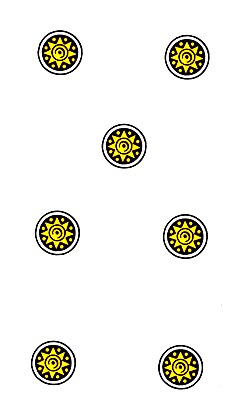

# Sweeper

**Scopa Italian card game score calculator**

_by [Kim Robinson](https://github.com/kimmykokonut)_

📝 No more hunting for scrap paper and a pen to keep score while playing Scopa!

🤯 Discover your Primiera total without a headache.

🌞 Save your mental energy for that Settebello swipe.



## Jump around

- [Introduction](#introduction)
- [Toolbelt](#toolbelt)
- [Known Bugs](#known-bugs)
- [Getting Started](#getting-started)
  - [Prerequisites](#prerequisites)
  - [Setup](#setup)
- [Stretch Goals](#stretch-goals)
- [Contact and Support](#contact-and-support)
- [License](#license)
- [Acknowledgements](#acknowledgements)

---

## Introduction

This is a work in progress that was inspired when teaching others how to play scopa and the ensueuing frustration regarding primiera scoring.
I thought it would be fun to build an app to calculate primiera for phase 1 while continuing to strengthen my skills in Typescript and React, and playing around with Vite's Progressive Web App plug in so I can have an app-like experience on my phone without needing to manage native code and maintain mobile store presence.

## Toolbelt


## Known Bugs

None at this time

## Getting Started

### Prerequisites

1. Code Editor

   To view or edit the code, you will need a code editor or text editor. The open-source code editor I used is VisualStudio Code.
   - Download: [VisualStudio Code](https://www.npmjs.com/)
   - Select the download most applicable to your OS and system.
   - Download & install -- Windows will run the setup exe and macOS will drag and drop into applications.

2. Node (& Homebrew)

```bash
node -v
```

_If you don't have node_, you can easily install via homebrew

```bash
brew install node
```

_If you don't have homebrew_, install instructions [here](https://brew.sh/)

### Setup

### Clone repository

1. Navigate to the [repository](https://github.com/kimmykokonut/score-sweep).

2. Select the `Fork` button and you will be taken to a new page where you can give your repository a new name and description. Choose "create fork".

3. Select the `Code` button and copy the url for HTTPS.

4. On your local computer, create a working directory of your choice.

5. Clone repo:

```bash
git clone https://github.com/kimmykokonut/score-sweep
```

6. Navigate into the project directory:

```bash
cd score-sweep
```

7. View/Edit in VS Code:

```bash
code .
```

8. Install dependencies:

```bash
npm install
```

9. Run local server:

```bash
npm run dev
```

Open [http://localhost:5173/](http://localhost:5173/) with your browser to see the local app.

## Stretch Goals

### Phases

1. Build Primiera calculator for 1 person
2. Primiera calc for up to 4 players, assess winner and display
3. Add scopa scorecard for up to 4 players
4. Progressive web app plugin

### Stretch

5. Data persistence investigation & implementation
6. Cribbage integration?

## Contact and Support

If you have any feedback or concerns,
[Report Bug](https://github.com/kimmykokonut/score-sweep/issues)
[Request Feature](https://github.com/kimmykokonut/score-sweep/issues)

## License

tbd

## Acknowledgements

Card images attributed to https://commons.wikimedia.org/wiki/Category:Naples_deck
